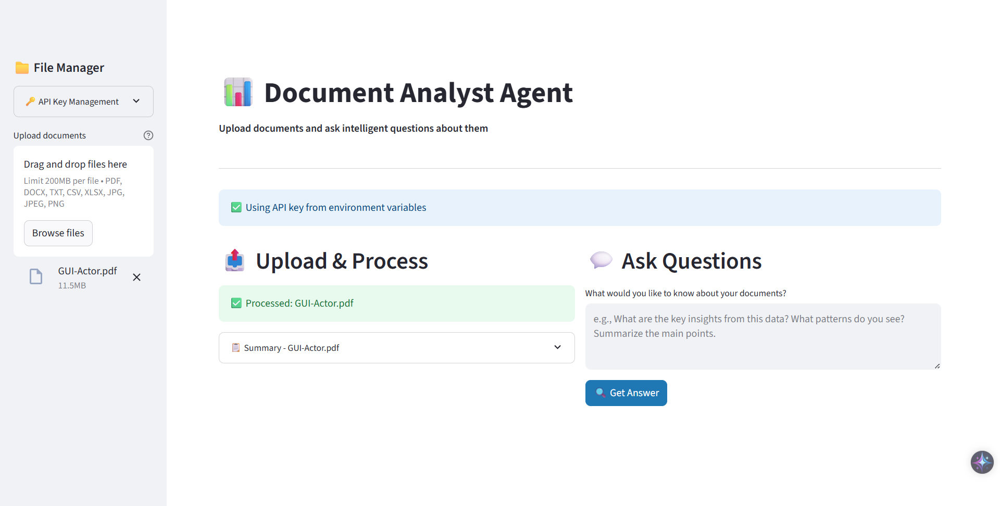

# 📊 Document Analyst Agent

> _"Because reading your own documents is so 2022. Let the AI do the heavy lifting while you take all the credit."_

---

## 😏 What Is This?

Welcome to **Document Analyst Agent** – the tool you never knew you desperately needed, built by _Devansh Singh_ (yes, I made this, and yes, I'm still waiting for my Nobel Prize) meet Analyst Agent

> _"Because reading your own documents is so 2022. Let the AI do the heavy lifting while you take all the credit."_

This Python-powered, AI-infused, sarcasm-enabled agent will:

- **Read** your PDFs, DOCX, TXT, CSV, Excel, and even images (OCR, because why not?).
- **Summarize** them using LLMs (Meta Llama-4, because GPT is too mainstream).
- **Analyze** your data (pandas, numpy, matplotlib, seaborn – the Avengers of data).
- **Visualize** trends and patterns (because you love pretty colors).
- **Answer** your questions, no matter how vague or oddly specific.
- **Generate Reports** that sound like you spent hours on them (you didn’t).

All this, wrapped in a Streamlit UI so easy, even your boss could use it (but please don’t let them).

---
> PS: Check Out 
 - [Bug Fix](#Bug-Fixes) below <br>
>In case you encounter any issues 

----

## 📸 ScreenShots
>Glimpses! so you know it works 😁 
 
  
> The UI may differ for you, If i decided to tweak it and not update the Screenshots. JK!

## 🚀 Features (Because You’re Too Busy to Read the Code)

- **Multi-format Support:** PDF, DOCX, TXT, CSV, XLSX, JPG, PNG, and more. If you can upload it, I’ll pretend I can read it.
- **LLM Summaries:** Uses Meta Llama-4 via Together API. If my API key dies, just use your own (Ctrl+F for `DEFAULT_API_KEY` – you’re welcome).
- **Data Analysis:** Automatic stats, missing values, unique counts, correlations, and more. No, you don’t need a PhD.
- **Visualizations:** Histograms, heatmaps, box plots, bar charts – all auto-generated, all Instagram-worthy.
- **Conversational Q&A:** Ask anything about your docs. The agent remembers the last 3 things you said, which is more than most people.
- **Comprehensive Reports:** Executive summaries, key findings, recommendations – so you can sound smart in meetings.
- **Streamlit UI:** Drag, drop, click, done. No command line, no existential crisis.

---

## 🛠️ How to Run (Because Reading Instructions Is Fun)

1. **Install Requirements:**

   ```sh
   pip install -r requirements.txt
   ```

   (Or just install everything you see in the imports. I believe in you.)

2. **Run the App:**

   ```sh
   python Data_Analyst_Agent.py
   ```

   Or, if you’re feeling rebellious:

   ```sh
   streamlit run Data_Analyst_Agent.py
   ```

3. **Wait for the browser to open.** If it doesn’t, open [http://localhost:8501](http://localhost:8501) yourself. I can’t do everything for you.

---

## 🔑 API Key (Because Free Lunches Don’t Last)

- Uses Together API for LLM magic.
- Default key is included (if it stops working, blame the universe).
- To use your own, search for [DEFAULT_API_KEY](http://_vscodecontentref_/0) in the code and replace it. Yes, you have to do it yourself.

## 🔑 API Key Configuration

For security, the application now uses environment variables to store your API key:

### Method 1: Environment File (Recommended)

1. **Copy the example file**:

   ```bash
   cp .env.example .env
   ```

2. **Edit the `.env` file** and add your Together AI API key:

   ```env
   TOGETHER_API_KEY=your_actual_api_key_here
   ```

3. **Get your API key** from [Together AI](https://together.ai/)

### Method 2: Temporary Override

You can also use the sidebar in the web interface to temporarily override the API key for a single session.

### Method 3: System Environment Variable

Set the environment variable in your system:

- **Windows**: `set TOGETHER_API_KEY=your_key_here`
- **macOS/Linux**: `export TOGETHER_API_KEY=your_key_here`

### Security Notes

- The `.env` file is automatically ignored by git (see `.gitignore`)
- Never commit your actual API key to version control
- Use the `.env.example` file as a template for others

---

## 🤖 How It Works (Magic, Basically)

1. **Upload Files:** PDFs, Excels, images, your hopes and dreams.
2. **Processing:** Text extraction, OCR, data loading, all automatic. You just sit there.
3. **Summaries & Analysis:** LLM-generated summaries, pandas-powered stats. You look smart.
4. **Visualizations:** Plots saved and shown in the UI. You pretend you made them.
5. **Ask Questions:** Type anything. Get answers. Repeat until satisfied or existential dread sets in.
6. **Reports:** One-click, professional, and (mostly) accurate. Fake it till you make it.

---

## 🏆 Why Use This?

- You hate manual data analysis.
- You want instant insights with zero effort.
- You like pretty charts but hate making them.
- You want to impress your boss with minimal work.
- You appreciate sarcasm in your tools.


## Bug Fixes 
### (Fixed Installation Issues!)

**IMPORTANT**: If you're getting numpy/pandas compatibility errors, we've fixed that!

1. **Setup Environment Variables** (recommended for security):

   ```bash
   # Copy the example file
   cp .env.example .env

   # Edit .env and add your Together AI API key
   # TOGETHER_API_KEY=your_actual_api_key_here
   ```

2. **Install Dependencies** (recommended):

   ```bash
   pip install -r requirements.txt
   ```

3. **Run the Application**:

   ```bash
   python Data_Analyst_Agent.py
   ```

4. **Access the Web Interface**:
   - The app will show the URL in the terminal
   - Manually navigate to: http://localhost:8501

## 🛠️ Installation Troubleshooting

If you encounter the numpy/pandas compatibility error:

```
ValueError: numpy.dtype size changed, may indicate binary incompatibility
```

**Quick Fix:**

```bash
pip uninstall numpy pandas -y
pip install numpy==1.24.3
pip install pandas==1.5.3
pip install -r requirements.txt
```

## 📝 Credits

Made with too much coffee and not enough sleep by **Devansh Singh**.

---

## ⚠️ Disclaimer

- This tool is for educational and productivity purposes. If it becomes sentient, it’s not my fault.
- LLM answers are only as good as your data (and your API key).
- No documents were harmed in the making of this agent (probably).

---

## 💌 Feedback

Open an issue, send a PR, or just scream into the void. I might respond. Or not.

---

Enjoy! (Or don’t.#
