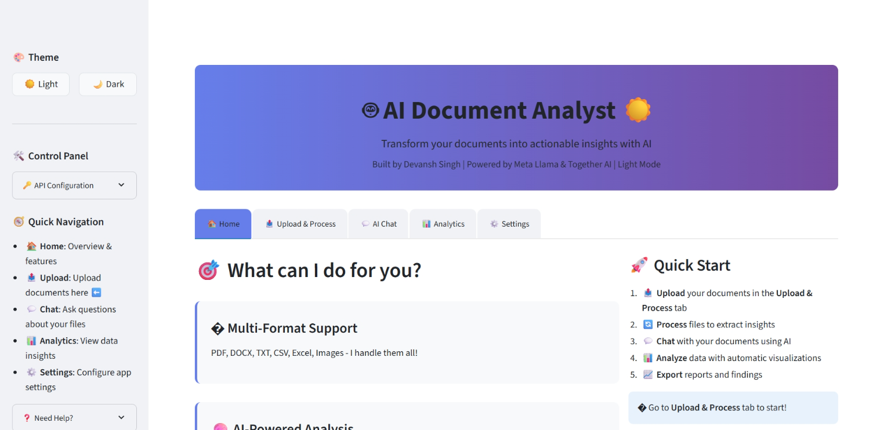
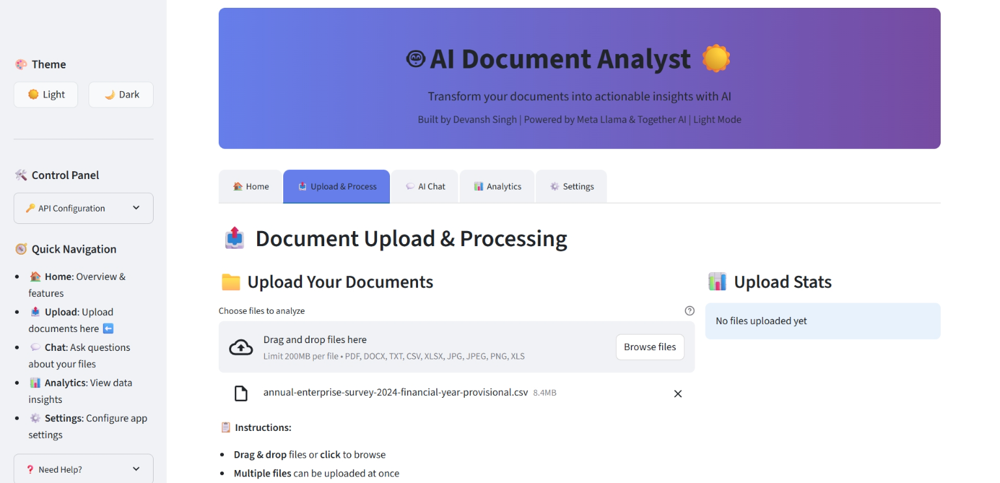
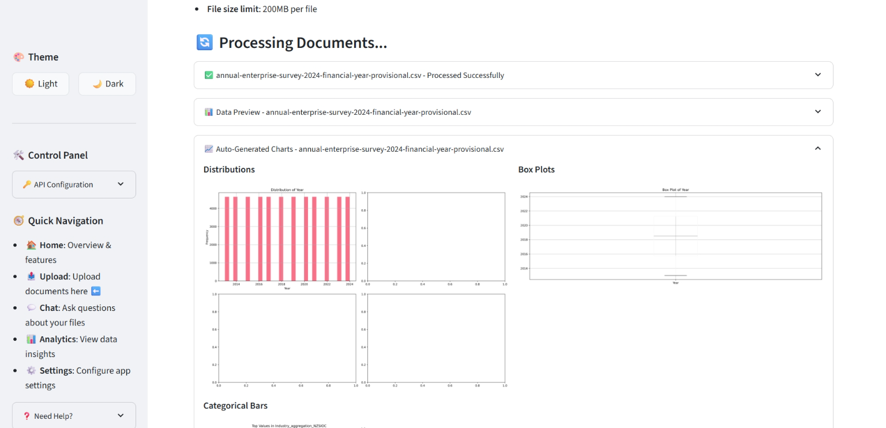
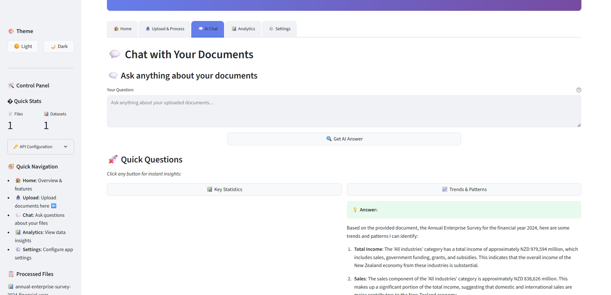
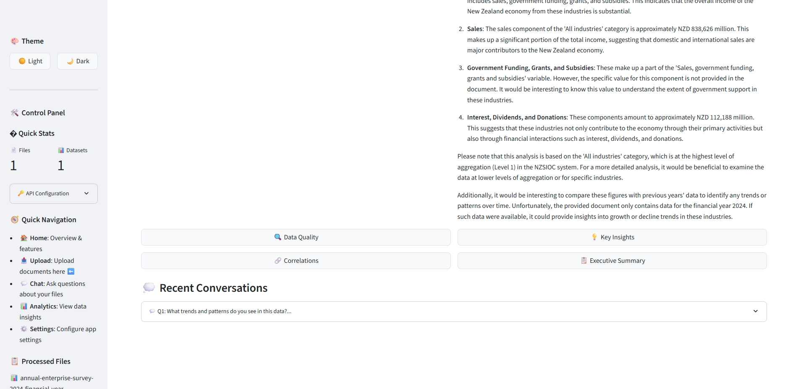
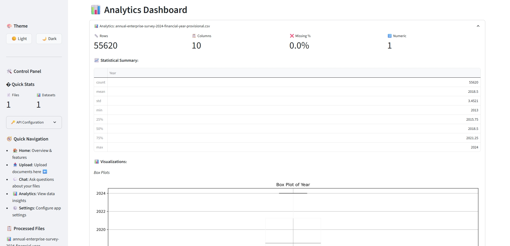
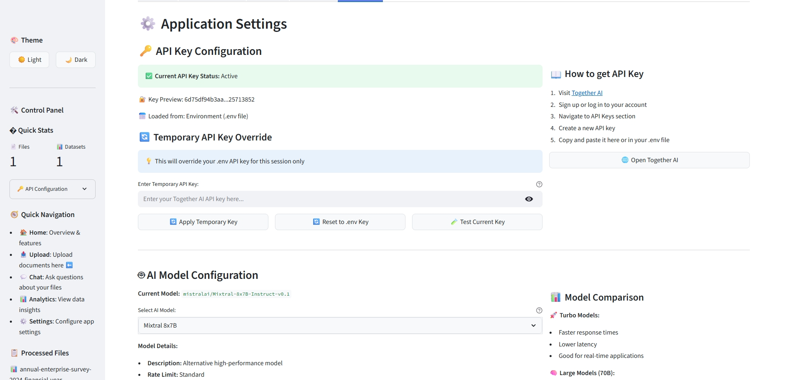
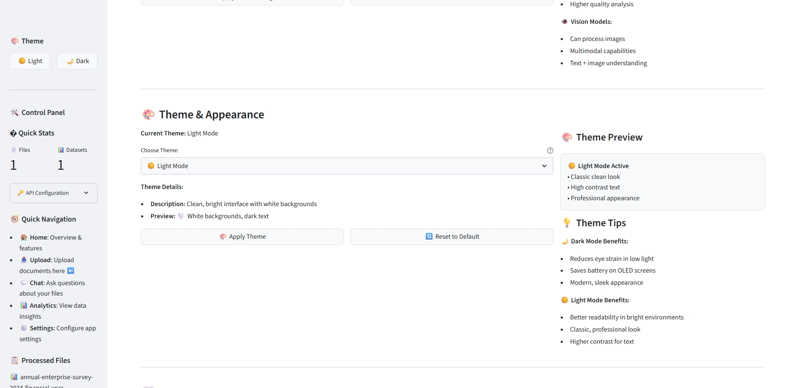

# 📊 AI Document Analyst v3.0

> _"Because reading your own documents is so 2022. Let the AI do the heavy lifting while you take all the credit. Now with 100% more dark mode and a backend that actually works!"_

<a id="top"></a>

---

## 🧭 Table of Contents

- [😏 What Is This Masterpiece?](#-what-is-this-masterpiece)
- [🕰️ What Was New in v2.0 (The Glow-Up Edition)](#-what-was-new-in-v20-the-glow-up-edition)
- [📸 Screenshots](#-screenshots)
- [🚀 Features](#-features-because-youre-too-busy-to-read-the-code)
  - [🏠 Home Tab](#-home-tab)
  - [📤 Upload & Process Tab](#-upload--process-tab)
  - [💬 AI Chat Tab](#-ai-chat-tab)
  - [📊 Analytics Tab](#-analytics-tab)
  - [⚙️ Settings Tab](#-settings-tab)
- [🛠️ How to Run](#-how-to-run-because-reading-instructions-is-actually-important)
  - [☁️ Deploy to Streamlit Cloud](#-deploy-to-streamlit-cloud-one-click)
- [🔑 API Key (OpenCode Zen)](#-api-key-opencode-zen)
  - [Local Development](#local-development)
  - [Streamlit Cloud Deployment](#streamlit-cloud-deployment)
  - [Available AI Models](#available-ai-models)
- [🤖 How It Works](#-how-it-works-magic-but-with-science)
- [🎯 Why Use This?](#-why-use-this-besides-my-incredible-ego)
- [🔧 Installation Troubleshooting](#-installation-troubleshooting)
- [📝 Credits & Thanks](#-credits--thanks)
- [⚠️ Disclaimer](#-disclaimer)
- [💌 Feedback & Support](#-feedback--support)
- [🎉 Recent Changes (v3.0)](#-recent-changes-v30)
  - [Backend Rewrite](#backend-rewrite)
  - [Code Structure](#code-structure)
  - [Deployment](#deployment)
  - [Hygiene](#hygiene)
  - [What Changed (v2.0 → v3.0)](#what-changed-v20--v30)
  - [What Did NOT Change](#what-did-not-change)
- [🧭 Project History](#-project-history)
- [👤 Maintainer](#-maintainer)

---

## 😏 What Is This Masterpiece?

Welcome to **AI Document Analyst v3.0** – the tool you never knew you desperately needed, now with a complete backend overhaul and a cleaner architecture. Built by _Devansh Singh_ (yes, I made this, and yes, I'm still waiting for my Nobel Prize).

This Python-powered, AI-infused, theme-switching, sarcasm-enabled agent will:

- **Read** your PDFs, DOCX, TXT, CSV, Excel, and even images (OCR, because why not?).
- **Summarize** them via **OpenCode Zen** — OpenAI-compatible chat completions, with `minimax-m3-free` as the default model.
- **Analyze** your data with pandas wizardry (the Avengers of data science).
- **Visualize** trends and patterns with auto-generated charts (because you love pretty colors).
- **Chat** with your documents like they're your best friend (spoiler: they're more reliable).
- **Switch** between light and dark themes (because your eyes deserve options).
- **Generate Reports** that sound like you spent hours on them (you didn't).
- **Deploy** to Streamlit Cloud with one click (yes, really).

All this, wrapped in a gorgeous Streamlit UI with tabs, themes, and more bells and whistles than a marching band.

[⬆ Back to top](#top)

---

## 🕰️ What Was New in v2.0 (The Glow-Up Edition)

<details>
<summary>📜 Click to expand the v2.0 changelog (historical context)</summary>

A historical changelog entry — v2.0 was the previous major version
before the 2026-06-05 reset to v3.0. Kept here for readers who arrive
via the v2.0 screenshots below.

- **🌙 Dark/Light Mode**: Toggle between themes like a pro. Your retinas will thank you.
- **📑 Tabbed Interface**: Home, Upload, Chat, Analytics, and Settings tabs. Organization is sexy.
- **🎯 Enhanced Upload**: Drag & drop files with style. Progress bars included (because waiting is fun).
- **💬 Interactive Chat**: Ask your documents anything. They actually respond now.
- **⚙️ Settings Panel**: Configure everything from AI models to themes. Power user vibes.
- **📊 Advanced Analytics**: Beautiful charts, stats, and insights that'll make Excel cry.
- **🎪 Better UI**: Modern gradients, cards, and animations. Instagram-worthy data analysis.

</details>

[⬆ Back to top](#top)

---

## 📸 Screenshots

> Glimpses! So you know it actually works 😁

<div align="center">
<table>
<tr>
<td align="center"><br><b>🏠 Home Dashboard</b></td>
<td align="center"><br><b>📤 Upload & Process</b></td>
</tr>
<tr>
<td align="center"><br><b>📊 File Processing</b></td>
<td align="center"><br><b>💬 AI Chat Interface</b></td>
</tr>
<tr>
<td align="center"><br><b>🤖 Chat Conversation</b></td>
<td align="center"><br><b>📊 Analytics Dashboard</b></td>
</tr>
<tr>
<td align="center"><br><b>⚙️ Settings Panel</b></td>
<td align="center"><br><b>🌙 Dark Mode Settings</b></td>
</tr>
</table>
</div>

> The UI may differ slightly if I decided to tweak it and forgot to update screenshots. JK! (But seriously, it might.)

[⬆ Back to top](#top)

---

## 🚀 Features (Because You're Too Busy to Read the Code)

### 🏠 **Home Tab**

- Welcome dashboard with feature overview
- Quick start guide (for the impatient)
- Status indicators (so you know things are working)

### 📤 **Upload & Process Tab**

- **Multi-format Support:** PDF, DOCX, TXT, CSV, XLSX, JPG, PNG, and more
- **Drag & Drop Interface:** Because clicking is so 2010
- **Real-time Processing:** Watch your files get analyzed in real-time
- **Progress Tracking:** Know exactly what's happening (transparency is key)
- **Auto-Visualization:** Charts generate themselves (like magic, but with code)

### 💬 **AI Chat Tab**

- **Conversational Q&A:** Ask anything about your documents
- **Context Awareness:** Remembers your conversation (better than most humans)
- **Quick Questions:** Pre-built buttons for instant insights
- **Smart Responses:** Powered by OpenCode Zen (OpenAI-compatible chat completions)

### 📊 **Analytics Tab**

- **Statistical Summaries:** Mean, median, mode, and other math-y things
- **Data Quality Checks:** Missing values, duplicates, outliers
- **Correlation Analysis:** Find relationships you never knew existed
- **Auto-Generated Charts:** Histograms, heatmaps, box plots, and more

### ⚙️ **Settings Tab**

- **API Key Management:** Built-in key configuration (no more .env hunting)
- **Model Selection:** Choose from multiple AI models
- **Theme Switching:** Light/Dark mode toggle
- **Processing Settings:** Customize AI behavior
- **Session Management:** Reset everything when you mess up

[⬆ Back to top](#top)

---

## 🛠️ How to Run (Because Reading Instructions Is Actually Important)

### 1. **Install Requirements:**

```sh
pip install -r requirements.txt
```

(Or just install everything you see in the imports. I believe in your package management skills.)

### 2. **Run the App:**

```sh
streamlit run app.py
```

> **Note:** the entrypoint is `app.py`, not `Agent.py`. `Agent.py` is
> the engine module; `app.py` is the Streamlit UI. The old
> `Data_Analyst_Agent.py` / `Agent.py` monolith is gone.

If `streamlit` is on your `PATH` you can also do `python -m streamlit run app.py`.

### 3. **Open Your Browser:**

- The app opens at `http://localhost:8501` (Streamlit's default)
- If it doesn't, manually navigate there (I can't click for you)

### 4. **Start Analyzing:**

- Set your `OPENCODE_API_KEY` in `.env` (or paste it into the app's
  **Settings** tab once it's running)
- Upload your files and start chatting — the default model is
  `minimax-m3-free` (no credit card burn)

### ☁️ **Deploy to Streamlit Cloud (one click):**

1. Push this repo to GitHub.
2. On [share.streamlit.io](https://share.streamlit.io), click **New app**,
   select the repo, and set the main file path to `app.py`.
3. Open **Advanced settings → Secrets** and paste:
   ```toml
   OPENCODE_API_KEY = "your_key_here"
   ```
4. Click **Deploy**. The first build will pull `tesseract` from
   `packages.txt` and Python deps from `requirements.txt`.

> `packages.txt` in the repo root installs the system `tesseract` binary
> on the Cloud image so image OCR works.

[⬆ Back to top](#top)

---

## 🔑 API Key (OpenCode Zen)

The app talks to **[OpenCode Zen](https://opencode.ai/zen)** — a single
endpoint that fronts multiple model providers behind an
OpenAI-compatible chat-completions API. Sign up there, paste a credit
card (the free tier is enough for most use), and grab an API key.

**Resolution order** (the app tries these in sequence):

1. `st.secrets["OPENCODE_API_KEY"]` — used when deployed on Streamlit Cloud
2. `OPENCODE_API_KEY` environment variable — used for local dev via `.env`
3. `TOGETHER_API_KEY` environment variable — legacy fallback from v2.0

### Local development

```sh
echo "OPENCODE_API_KEY=your_key_here" > .env
```

### Streamlit Cloud deployment

In the app dashboard, go to **Settings → Secrets** and paste:

```toml
OPENCODE_API_KEY = "your_key_here"
```

Save. The app will reboot and pick the key up automatically — no
code change needed.

[⬆ Back to top](#top)

### Available AI Models

<details>
<summary>🤖 Click to see all 10 supported models (default is <code>minimax-m3-free</code>)</summary>

Default model is `minimax-m3-free` (free tier). You can swap to any of
these from the in-app **Settings** tab:

- `minimax-m3-free` — default, free tier
- `mimo-v2.5-free` — free tier
- `qwen3.6-plus-free` — free tier
- `deepseek-v4-flash-free` — free tier
- `nemotron-3-ultra-free` — free tier
- `minimax-m2.7` — paid, latest MiniMax
- `minimax-m2.5` — paid, previous MiniMax
- `gpt-5` — paid, via Zen
- `claude-sonnet-4-6` — paid, via Zen
- `gemini-3.1-pro` — paid, via Zen

The full live catalog is at `https://opencode.ai/zen/v1/models`.

</details>

---

## 🤖 How It Works (Magic, But With Science)

1. **🏠 Start at Home:** Overview of features and quick start guide
2. **📤 Upload Files:** Drag & drop your documents in the Upload tab
3. **🔄 Auto-Processing:** Text extraction, OCR, data loading - all automatic
4. **📊 Get Analytics:** Instant stats, charts, and insights in the Analytics tab
5. **💬 Chat Away:** Ask questions in the Chat tab - get smart answers
6. **⚙️ Customize:** Tweak settings, change themes, swap AI models
7. **📈 Export Results:** Screenshots, insights, whatever you need

[⬆ Back to top](#top)

---

## 🎯 Why Use This? (Besides My Incredible Ego)

- **Zero Setup Hassle:** API key included, just run and go
- **Beautiful UI:** Dark mode, themes, modern design
- **Actually Smart:** Real AI analysis, not just fancy buttons
- **Multiple File Types:** PDF, Excel, images - it reads everything
- **Conversation Memory:** Ask follow-up questions like a normal human
- **Free to Use:** No hidden costs, no subscription nonsense
- **Regular Updates:** I actually maintain this thing

[⬆ Back to top](#top)

---

## 🔧 Installation Troubleshooting

If you encounter any errors (because software is never perfect):

### Numpy/Pandas Issues:

```bash
pip uninstall numpy pandas -y
pip install numpy==1.24.3
pip install pandas==1.5.3
pip install -r requirements.txt
```

### Streamlit Issues:

```bash
pip install --upgrade streamlit
```

### API Issues:

- Get a key from [OpenCode Zen](https://opencode.ai/zen)
- Add it in the **Settings** tab of the app, in `.env` (local), or in
  Streamlit Cloud → Settings → Secrets (deployment)
- The app will pick it up on next reload

[⬆ Back to top](#top)

---

## 📝 Credits & Thanks

Made with excessive amounts of coffee, determination, and a healthy dose of sarcasm by **Devansh Singh**.

Special thanks to:

- **OpenCode Zen** for their OpenAI-compatible chat API
- **Streamlit** for making beautiful UIs possible
- **Meta** for Llama models that actually work
- **You** for using this instead of doing manual analysis

[⬆ Back to top](#top)

---

## ⚠️ Disclaimer

- This tool is for educational and productivity purposes
- AI responses are smart but not infallible (unlike me)
- No documents were harmed in the making of this agent
- Dark mode may cause addiction to superior UI experiences
- Free API usage is subject to reasonable limits (don't abuse it)

[⬆ Back to top](#top)

---

## 💌 Feedback & Support

- Open an issue on GitHub (I actually read them)
- Email: dksdevansh@gmail.com (for serious stuff)
- Or just scream into the void (therapeutic but less helpful)

[⬆ Back to top](#top)

---

## 🎉 Recent Changes (v3.0)

<details>
<summary><h3 style="display:inline">Backend rewrite</h3></summary>

- **Together AI → OpenCode Zen.** The `together` SDK is gone. The agent
  now uses plain `requests` against
  `https://opencode.ai/zen/v1/chat/completions` (OpenAI-compatible).
- **Default model:** `minimax-m3-free` (free tier; switchable from the
  in-app Settings tab).
- **Smaller, focused dependency list.** No more SDK lock-in.

</details>

<details>
<summary><h3 style="display:inline">Code structure</h3></summary>

- **`Agent.py` is now engine-only.** No more Streamlit UI or
  ~700 lines of CSS living alongside the agent.
- **`app.py` is the new Streamlit entrypoint.** It imports
  `DocumentAnalystAgent` and is the file you point Streamlit Cloud at.
- **Theme CSS cut from ~700 lines to ~50.** Scoped to stable
  `data-testid` attributes instead of brittle internal class names.
- **Matplotlib pinned to the `Agg` backend** so charts render on
  headless hosts (Streamlit Cloud).

</details>

<details>
<summary><h3 style="display:inline">Deployment</h3></summary>

- **One-click deploy to Streamlit Cloud.** Point at the repo, set the
  main file to `app.py`, paste your `OPENCODE_API_KEY` into Secrets.
- **`packages.txt` added** to install the system `tesseract` binary
  for OCR on Cloud images.
- **`.streamlit/config.toml`** sets sensible Cloud-friendly defaults
  (headless, port 8501, dark theme).

</details>

<details>
<summary><h3 style="display:inline">Hygiene</h3></summary>

- **Real API key removed from `.env`.** Now a placeholder only.
  Streamlit Cloud reads the real key from its Secrets manager.
- **`ISSUES.md` added** with the full audit of the v2.0 codebase
  (35 findings, severity-grouped, with refactor status per item).

</details>

<details>
<summary><h3 style="display:inline">What Changed (v2.0 → v3.0)</h3></summary>

1. **Together AI → OpenCode Zen** (OpenAI-compatible chat API)
2. **Monolithic `Agent.py` → split into `Agent.py` (engine) + `app.py` (UI)**
3. **Built-in free key → BYO key via `.env` or Streamlit Secrets**
4. **Local-only → Streamlit Cloud-ready** (`packages.txt`, `config.toml`, `Agg` backend)
5. **No CSS maintenance plan → ~50 lines of stable-selector CSS**
6. **No security review → `ISSUES.md` audit**

</details>

<details>
<summary><h3 style="display:inline">What did NOT change</h3></summary>

- The 5-tab UI layout (Home, Upload, Chat, Analytics, Settings)
- Light/Dark theme toggle
- Supported file types (PDF, DOCX, TXT, CSV, XLSX, images)
- Pandas / matplotlib / seaborn analysis & visualisation behaviour

</details>

[⬆ Back to top](#top)

---

## 🧭 Project History

This repo went through a one-time history reset on **2026-06-05**.

Prior to that date, the `main` branch carried 26 commits of v2.0 history
that mixed the agent, the Streamlit UI, the launcher, and ~700 lines of
theme CSS in a single 2,197-line `Agent.py` file, with a real
`TOGETHER_API_KEY` committed to `.env`. The reset replaced that history
with the v3.0 structure described above.

If you're looking at an old clone and `git pull` shows nothing, that's
why — please re-clone.

[⬆ Back to top](#top)

---

## 👤 Maintainer

This project is maintained solely by **[@DevanshSrajput](https://github.com/DevanshSrajput)** (Devansh Singh).

As of **2026-06-05**, collaborator write access for **@aditya-ig10** has
been revoked. The repo is now single-maintainer; PRs from other
contributors are not accepted and pushes from outside the maintainer
account will be force-reverted.

For issues, suggestions, or security reports, contact
`dksdevansh@gmail.com`.

[⬆ Back to top](#top)

---

Enjoy the new and improved document analysis experience! (Or don't, but at least it looks pretty now) 🚀
